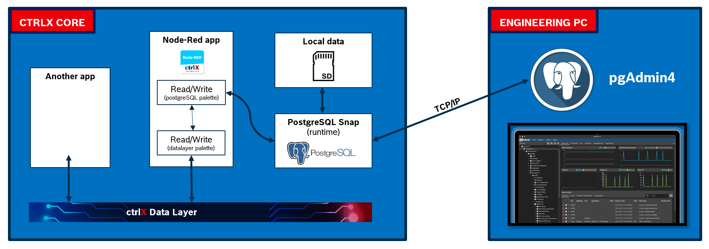

  [](https://opensource.org/licenses/MIT)


sudo -u raul /usr/lib/postgresql/14/bin/postgres --config-file=/home/raul/ctrlx_postgresql/shscripts/data/configuration/postgresql.conf -D /home/raul/data_postgresql


# ctrlx-mongodb

This respository contains the source code and build instructions to generate the ctrlx-mongodb snap yourself. Shortly speaking, the ctrlx-mongodb packs mongo DB 7.0 for ubuntu 2022 with amd64 architecture. It targets ctrlX CORE virtual, ctrlX CORE X5 and ctrlX CORE x7 running ctrlX OS 2.xx (base apps running an ubuntu core 22). This application is (and will be) only supported for amd64 architecture. See the end of this README for further explainations about this issue.

This repository is based in the [official mongodb36-configurable-snap repository](https://github.com/mauringo/mongodb36-configurable-snap) and it has been initially modified following the indications from Mauro Riboni in [SDK - Empower your app with Data Persistence](https://developer.community.boschrexroth.com/t5/Store-and-How-to/SDK-Empower-your-app-with-Data-Persistence/ba-p/69121). It has been then further adapted by Raul Cruz-Oliver to target ubuntu 22, including all the neccesary dependencies. 

## Author details
<mark>**DISCLAIMER: This is not an official Bosch Rexroth development. This is only a demo example, use at your own risk. There is no support.**</mark> 

Author: Raul Cruz-Oliver \
Main contact email: raul.cruz.oliver@gmail.com \
Date: November 2023 \
License: MIT

## System overview
The following diagram shows how mongo DB will integrated in ctrlX OS. The mongo DB runtime is packed in a snap and installed in the CORE, the user can configure where the data will be stored, for example in a external media like the an SD Card. Moreover, via a TCP/IP communication the mongo DB daemon in the ctrlX OS can connect to mongo DB Compass (GUI Deskop client application) in a engineering PC to easily visualize and export the data base.



Please visit [Mongo DB in ctrlX CORE OS](https://developer.community.boschrexroth.com/t5/forums/editpage/board-id/dcdev_community-dev-blog/message-id/969), where the functionalities of this app are explained in detail. Likewise, the already created snap can be downloaded there. 


## Easy start-up

### 0. Clone this respository
This example is designed for Ubuntu Jammy Jellyfish 22.04 x86_64 Desktop.

Open a terminal, it will be started in your home directory. This is the best place to clone this repository. Simply enter:

```bash
sudo apt install git # if you do not have git install in your system

git clone https://github.com/rcruzoliver/ctrlx_mongodb
```

### 1. Prepare your system
You will pack mongo DB in a snap using a strategy in which some local installed packages are staged during snapcraft process, so, you need to install Mongo DB in your system. You can either follow the [official guide](https://www.mongodb.com/docs/manual/tutorial/install-mongodb-on-ubuntu/#std-label-install-mdb-community-ubuntu) to install Mongo DB Community Edition on Ubuntu, or simply follow the summarized tutorial I include next.

- Install gnupg and curl
```bash
sudo apt-get install gnupg curl
```
- Include the MongoDB public GPG key (grant access for download)
```bash
curl -fsSL https://pgp.mongodb.com/server-7.0.asc | \
   sudo gpg -o /usr/share/keyrings/mongodb-server-7.0.gpg \
   --dearmor
```
- Create a source list file for Mongo DB to specify the repositories from which the packages will be downloded
```bash
echo "deb [ arch=amd64,arm64 signed-by=/usr/share/keyrings/mongodb-server-7.0.gpg ] https://repo.mongodb.org/apt/ubuntu jammy/mongodb-org/7.0 multiverse" | sudo tee /etc/apt/sources.list.d/mongodb-org-7.0.list
```
- Update the package database (link the source for mongoDB you included before)
```bash
sudo apt-get update
```
- Install latest version of MongoDB. You could also choose an old version. By the time this was written, the latest was 7.0 (see bash output following), please consider forcing this version if the application is not working with a newer version of Mongo DB
```bash
sudo apt-get install -y mongodb-org
```
Verify you get this output in your console:
```bash
Get:1 https://repo.mongodb.org/apt/ubuntu jammy/mongodb-org/7.0/multiverse amd64 mongodb-database-tools amd64 100.9.4 [51.9 MB] 
Get:2 https://repo.mongodb.org/apt/ubuntu jammy/mongodb-org/7.0/multiverse amd64 mongodb-mongosh amd64 2.1.1 [47.9 MB] 
Get:3 https://repo.mongodb.org/apt/ubuntu jammy/mongodb-org/7.0/multiverse amd64 mongodb-org-shell amd64 7.0.4 [2,986 B] 
Get:4 https://repo.mongodb.org/apt/ubuntu jammy/mongodb-org/7.0/multiverse amd64 mongodb-org-server amd64 7.0.4 [36.5 MB] 
Get:5 https://repo.mongodb.org/apt/ubuntu jammy/mongodb-org/7.0/multiverse amd64 mongodb-org-mongos amd64 7.0.4 [25.4 MB] 
Get:6 https://repo.mongodb.org/apt/ubuntu jammy/mongodb-org/7.0/multiverse amd64 mongodb-org-database-tools-extra amd64 7.0.4 [7,756 B] 
Get:7 https://repo.mongodb.org/apt/ubuntu jammy/mongodb-org/7.0/multiverse amd64 mongodb-org-database amd64 7.0.4 [3,426 B] 
Get:8 https://repo.mongodb.org/apt/ubuntu jammy/mongodb-org/7.0/multiverse amd64 mongodb-org-tools amd64 7.0.4 [2,768 B] 
Get:9 https://repo.mongodb.org/apt/ubuntu jammy/mongodb-org/7.0/multiverse amd64 mongodb-org amd64 7.0.4 [2,802 B] 
```

If everything was succesful, mongo DB should be already installed. You can check if it works with:

- Start the Mongo DB daemon (mongod) with
```bash
sudo systemctl daemon-reload
sudo systemctl start mongod
```
- Verify it is awake
```bash
sudo systemctl status mongod
```
- You can stop the daemon with
```bash
sudo systemctl stop mongod
```

### 2. Create the snap
The process has been automated for you in createSnap.sh. Just enter the following commands:
```bash
cd ctrlx-mongodb
./createSnap
```
The details about the snap/snapcraft.yalm file and other files that are dumped in the snap can be better understood by reading [SDK - Empower your app with Data Persistence](https://developer.community.boschrexroth.com/t5/Store-and-How-to/SDK-Empower-your-app-with-Data-Persistence/ba-p/69121).

### 3. Install the snap in ctrlX CORE
After running the process to create the snap, if it was sucessful, you will get a file called "ctrlx-mongodb_2.2.0_amd64.snap".

This .snap file can be directly intalled in CtrlX Core from the Apps menu. Just as a reminder, since this new app you just built has not been signed, you need to allow the installation from "unknown sources" in your device.


## Why is this app not available for X3?

ctrlX CORE X3 has a 64 Bit Quad-Core ARM CPU, in particular with arm64:v8.0 processing architecture. Just as a comment, it is the same processing architecture in Raspberry Pi model 4, for this reason is the rpi a good platform to test the developments targeted to ctrlX CORE x3. The new ctrlX OS 2.xx is based on a ubuntu core 22 (similar to Ubuntu Desktop 22.04), which is the platform we are developping for. It does not make any sense to develop for ctrlX OS 1.20 (ubuntu core 20), because most of the advanced features are intensily developped for the new OS.

If we look at the [Production notes for Mongo DB 7.0](https://www.mongodb.com/docs/manual/administration/production-notes/) we find some interesting comments:

- x86_64 (amd64): from Mongo DB version 5.0+ the AVX instruction set is required. Luckly it is availble in the amd64 ctrlX Ecosystem devices. 
- ARM64: from Mongo DB version 5.0+ arm64:v8.2A+ is required. Sadly, this is not met in X3.

So, one can think that let's go with the latest Mongo DB version that runs in arm64:v8.0. It is Mongo DB 4.4. However, we find the following: 


It will not work in Ubuntu 22, ergo in ctrlX OS 2.xx. Summary, with this generation of X3, mongo DB can not be ported. 

****************

Although I just said Mongo DB will never work in X3, I was lying ;). There is actually an strategy that we can follow: running it in Docker !!!

First idea could be emulating arm64/ubuntu20 in the container and then running there version 4.4. Although it should work, I have not tested it.

We can also think about emulating amd64 architecture in the container. However, the emulated architecture amd64 has no AVX instruction set, therefore we need to try with 4.4 here as well. It works. Now the question, is it worth it to use this? 

If you still want to use it, what I have done is the following:
```bash
# start the container
sudo docker run --platform linux/amd64 -p 27017:27017 --name <CONTAINER_NAME> mongo:4.4
# connect the CLI, command in 4.4 is "mongo", not "mongos" (if it connects, it means the daemon is alive)
sudo docker exec -it <CONTAINER_NAME> mongo
```

Then you need to pack the this docker image in a snap to install it in the ctrlX OS. Then, cross-your fings and hope the [ctrlX Container Engine](https://developer.community.boschrexroth.com/t5/Store-and-How-to/ctrlX-AUTOMATION-Container-Engine/ba-p/57324) suports this image, you can also find a template to pack your DockerImage in a snap. I am not sue how the ctrlX Container Engine will behave with qemu. If you manage to make it work, please email me in raul.cruz.oliver@gmail.com

And on top of all of that, it is still Mongo DB 4.4. with way less functionalities, and not granted performance with Mongo DB Compass.

Finally, find here a summary of all the test I have done. Do not waste your time doing the same I already did. I have been working in a Raspi Model 4 with Ubuntu 22.04 Desktop. It should behave identially as an X3 with 2.xx.

